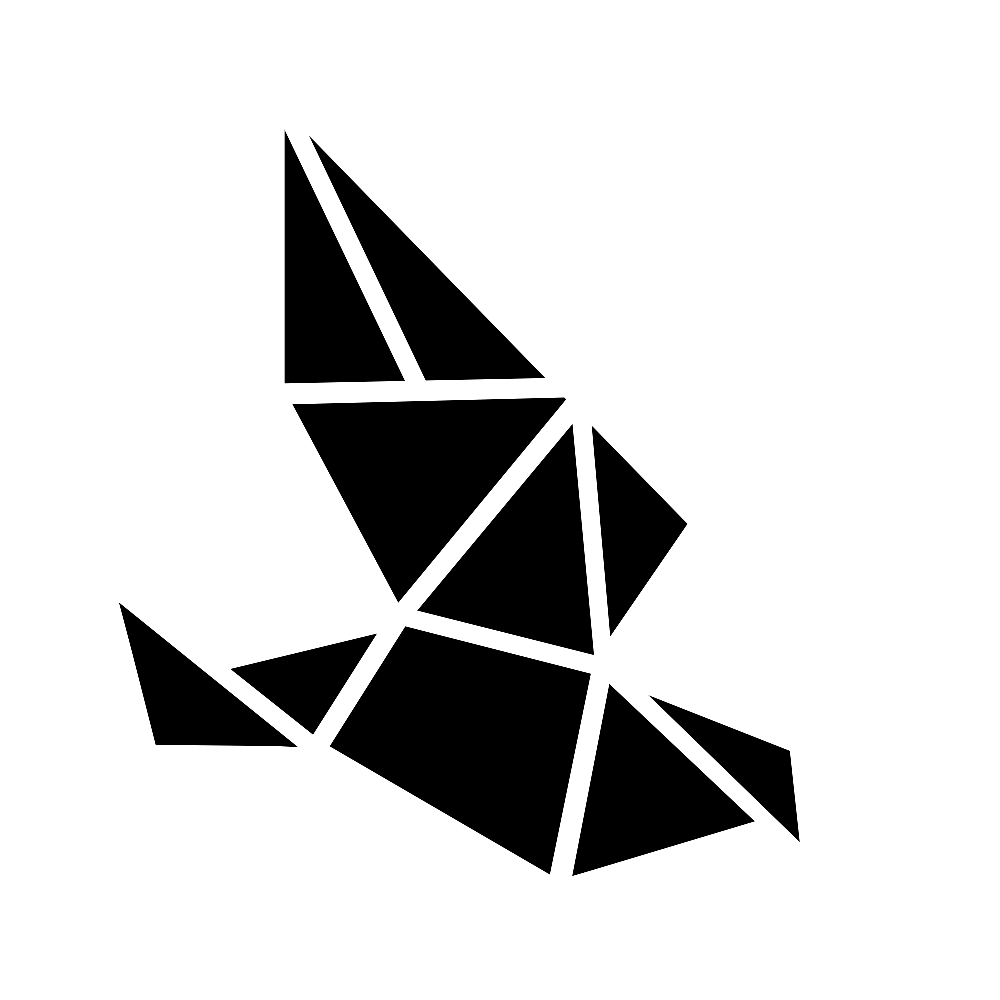

<div align="center">
  <a href="https://github.com/WeirdPtr/lightlog/">
    
  </a>
</div>

<div id="top"></div>
<div align="center">
<h3 align="center">lightlog</h3>

  <p align="center">
    light log is a basic lightweight rust logging crate. 
    <br />
    <br />
    <a href="https://github.com/WeirdPtr/lightlog/issues">Report Bug</a>
    ·
    <a href="https://github.com/WeirdPtr/lightlog/issues">Request Feature</a>
  </p>
</div>

## About The Project

### Built With

- [Rust](https://www.rust-lang.org/)

### Prerequisites

- [Rust](https://www.rust-lang.org/tools/install)

### Usage

```rust
let logger: Logger = Logger::default();

// Logging Levels are None, Full, Info, Warning, Error
// Default is Full

// Set logging level
logger.set_level(LoggingLevel::Full);

// Set default origin (default is "")
logger.set_default_origin("Logger".to_string());

// Logging with origin
// [2022-07-3017:51:01] [INFO] [LogOrigin]: Info Test
logger.log_origin_message("Info Test", LoggingType::Info, Some("LogOrigin"));
logger.log_origin_message("Warning Test", LoggingType::Warning, Some("LogOrigin"));
logger.log_origin_message("Error Test", LoggingType::Error, Some("LogOrigin"));
logger.log_origin_message("Debug Test", LoggingType::Debug, Some("LogOrigin"));

// Logging without origin
// [2022-07-3017:51:01] [INFO]: Info Test
logger.log_message("Info Test", LoggingType::Info);
logger.log_message("Warning Test", LoggingType::Warning);
logger.log_message("Error Test", LoggingType::Error);
logger.log_message("Debug Test", LoggingType::Debug);
```

## Roadmap

- [ ] Configuration
  - [ ] custom log colors

See the [open issues](https://github.com/WeirdPtr/lightlog/issues) for a full list of proposed features (and known issues).

## Contributing

If you have a suggestion that would make this better, please fork the repo and create a pull request. You can also simply open an issue with the tag "enhancement".

1. Fork the Project
2. Create your Feature Branch (`git checkout -b feature/AmazingFeature`)
3. Commit your Changes (`git commit -m 'Add some AmazingFeature'`)
4. Push to the Branch (`git push origin feature/AmazingFeature`)
5. Open a Pull Request

## License

Distributed under the MIT License. See [`LICENSE`](https://github.com/WeirdPtr/lightlog/blob/master/LICENSE) for more information.
